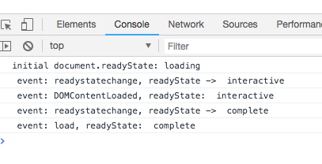

Html "onready" "load" "readyState" Demo
=======================================

HTML DOM中没有`onready`事件，它是jquery中提出来的概念，使用了DOM中的`DOMContentLoaded`的事件（或者通过模拟方式）。

这个Demo主要展示`DOMContentLoaded/load/readyState`之间的关系。

```
open index.html
```


